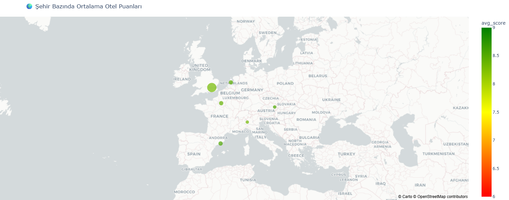
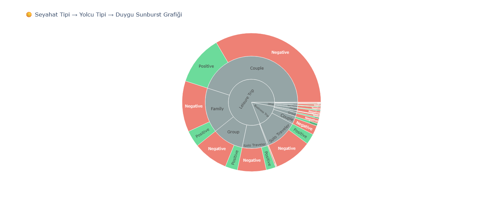
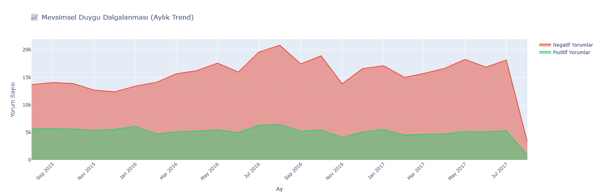
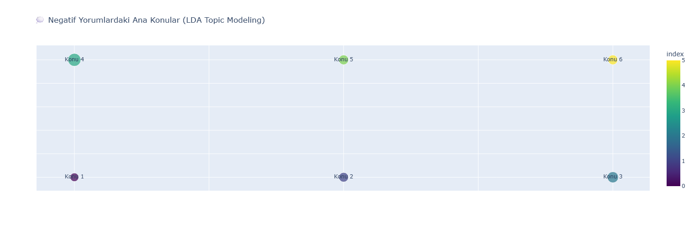

<p align="center">
  
  
  
  
  
</p>

<h1 align="center">🏨 Hotel Reviews Sentiment Analysis</h1>

<p align="center">
  <strong>A comprehensive NLP pipeline for analyzing hotel reviews with advanced machine learning models and interactive visualizations</strong>
</p>

<p align="center">
  <a href="#-features">Features</a> •
  <a href="#-model-performance">Performance</a> •
  <a href="#-installation">Installation</a> •
  <a href="#-usage">Usage</a> •
  <a href="#-visualizations">Visualizations</a> •
  <a href="#-project-structure">Structure</a>
</p>

---

## 📋 Overview

This project implements a **dual-model sentiment analysis system** for hotel reviews, combining **traditional machine learning** (Decision Tree with TF-IDF) and **deep learning** (GRU Neural Network) approaches. The system processes over **515,000 European hotel reviews** to classify sentiments and extract actionable business insights.

### 🎯 Key Objectives

- **Binary Sentiment Classification**: Accurately classify reviews as positive or negative
- **Comparative Model Analysis**: Benchmark Decision Tree vs. GRU performance
- **Business Intelligence**: Extract insights through advanced EDA and topic modeling
- **Geospatial Analysis**: Map sentiment patterns across European cities

---

## ✨ Features

### 🤖 Machine Learning Models

| Model | Type | Accuracy | F1 Score |
|-------|------|----------|----------|
| **GRU Neural Network** | Deep Learning | **96.69%** | **93.31%** |
| **Decision Tree** | Traditional ML | ~85% | ~80% |

### 📊 Exploratory Data Analysis

- **Geospatial Sentiment Mapping**: Interactive heatmaps across 7 European cities
- **Nationality-Based Analysis**: Cross-cultural sentiment patterns
- **Trip Segmentation**: Business vs. Leisure traveler insights
- **Topic Modeling (LDA)**: Automated complaint categorization
- **Time-Series Trends**: Seasonal quality fluctuations
- **Gap Analysis**: Expectation vs. Reality hotel ratings

---

## 🏆 Model Performance

### GRU Neural Network Results

```
┌─────────────────────────────────────────────────────────────┐
│  GRU MODEL PERFORMANCE                                       │
├─────────────────────────────────────────────────────────────┤
│  Accuracy:        96.69%                                     │
│  F1 Score:        93.31%                                     │
│  Precision:       93.52%                                     │
│  Recall:          93.10%                                     │
└─────────────────────────────────────────────────────────────┘
```

### Confusion Matrix

|  | Predicted Negative | Predicted Positive |
|---|:---:|:---:|
| **Actual Negative** | 18,980 | 412 |
| **Actual Positive** | 442 | 5,953 |

---

## 🛠️ Installation

### Prerequisites

- Python 3.9 or higher
- pip package manager

### Quick Start

```bash
# Clone the repository
git clone https://github.com/MustafaKocamann/NLP-Projects.git
cd NLP-Projects/sentiment_analysis1

# Create virtual environment
python -m venv venv

# Activate virtual environment
# Windows
venv\Scripts\activate
# macOS/Linux
source venv/bin/activate

# Install dependencies
pip install -r requirements.txt
```

### Core Dependencies

```
tensorflow>=2.20.0
scikit-learn>=1.8.0
pandas>=3.0.0
numpy>=2.4.2
plotly>=5.0.0
matplotlib>=3.10.0
seaborn>=0.13.0
nltk>=3.9.0
```

---

## 🚀 Usage

### Training the Models

```bash
# Run the training pipeline
python train.py
```

This will:
1. Load and preprocess the hotel reviews dataset
2. Apply text cleaning (lowercasing, URL/HTML removal, punctuation stripping)
3. Train a Decision Tree classifier with TF-IDF vectorization
4. Train a GRU neural network with word embeddings
5. Output performance metrics and confusion matrices

### Running Exploratory Data Analysis

```bash
# Execute comprehensive EDA with interactive visualizations
python eda.py
```

This generates 17+ interactive Plotly visualizations including:
- Geospatial heatmaps
- Sentiment distribution charts
- Topic modeling results
- Time-series analysis

---

## 📈 Visualizations

<table>
  <tr>
    <td align="center">
      <br/>
      <strong>City-Level Hotel Ratings Map</strong>
    </td>
    <td align="center">
      <br/>
      <strong>Nationality-City Sentiment Flow</strong>
    </td>
  </tr>
  <tr>
    <td align="center">
      <br/>
      <strong>Trip Type Segmentation Analysis</strong>
    </td>
    <td align="center">
      <br/>
      <strong>Seasonal Sentiment Trends</strong>
    </td>
  </tr>
  <tr>
    <td align="center">
      <br/>
      <strong>Negative Review Topic Modeling</strong>
    </td>
    <td align="center">
      <br/>
      <strong>Top Performing Hotels</strong>
    </td>
  </tr>
</table>

---

## 📁 Project Structure

```
sentiment_analysis1/
├── 📄 train.py              # ML training pipeline (Decision Tree + GRU)
├── 📄 eda.py                # Comprehensive exploratory data analysis
├── 📄 requirements.txt      # Python dependencies
├── 📄 README.md             # Project documentation
├── 📂 images/               # Generated visualization exports
│   ├── sehirotel.png        # City-level hotel map
│   ├── milliyetsehirdiyagram.png  # Nationality flow diagram
│   ├── mevsimsel.png        # Seasonal trends
│   └── ... (17 visualization files)
└── 📂 venv/                 # Virtual environment
```

---

## 🔬 Technical Architecture

### Text Preprocessing Pipeline

```python
def clean_text(text):
    text = text.lower()                          # Lowercase conversion
    text = re.sub(r"https?://\S+", "", text)     # URL removal
    text = re.sub(r"<.*?>", "", text)            # HTML tag removal
    text = re.sub(r"[^\w\s]", "", text)          # Punctuation removal
    text = re.sub(r"\d+", "", text)              # Number removal
    text = re.sub(r"\s+", " ", text).strip()     # Whitespace normalization
    return text
```

### GRU Neural Network Architecture

```
┌──────────────────────────────────────────────────┐
│  Input Layer (Tokenized Sequences)               │
├──────────────────────────────────────────────────┤
│  Embedding Layer (vocab_size → 128 dimensions)   │
├──────────────────────────────────────────────────┤
│  GRU Layer (128 units)                           │
├──────────────────────────────────────────────────┤
│  Dropout Layer (0.5)                             │
├──────────────────────────────────────────────────┤
│  Dense Layer (1 unit, sigmoid activation)        │
└──────────────────────────────────────────────────┘
```

---

## 📊 Dataset Information

| Attribute | Value |
|-----------|-------|
| **Source** | Kaggle - 515K Hotel Reviews in Europe |
| **Total Reviews** | 515,738 |
| **Hotels Covered** | 1,493 |
| **Cities** | London, Paris, Barcelona, Amsterdam, Vienna, Milan, Berlin |
| **Time Period** | 2015-2017 |
| **File Size** | ~238 MB |

---

## 🔮 Key Insights

### 📍 Geographic Patterns
- **Vienna** and **Barcelona** consistently receive the highest average scores
- **London** hotels show the highest review volume but moderate satisfaction

### 🧳 Traveler Segmentation
- **Business travelers** are more critical than leisure travelers
- **Solo travelers** have higher satisfaction rates than groups

### 📅 Temporal Trends
- Peak complaint periods align with high tourism seasons
- Quality consistency improves over time across most cities

### 💬 Common Complaint Topics (LDA)
1. Room cleanliness and maintenance
2. Noise levels and location
3. Staff service and responsiveness
4. Breakfast quality and pricing
5. Check-in/check-out process
6. Room size and amenities

---

## 🤝 Contributing

Contributions are welcome! Please feel free to submit a Pull Request.

1. Fork the repository
2. Create your feature branch (`git checkout -b feature/AmazingFeature`)
3. Commit your changes (`git commit -m 'Add some AmazingFeature'`)
4. Push to the branch (`git push origin feature/AmazingFeature`)
5. Open a Pull Request

---

## 📜 License

This project is licensed under the MIT License - see the [LICENSE](LICENSE) file for details.

---

## 👤 Author

**Mustafa Kocaman**

- GitHub: [@MustafaKocamann](https://github.com/MustafaKocamann)
- Email: mustafakocaman789@gmail.com

---

## 🙏 Acknowledgements

- [Kaggle](https://www.kaggle.com/) for the Hotel Reviews dataset
- [TensorFlow](https://www.tensorflow.org/) team for the deep learning framework
- [Plotly](https://plotly.com/) for interactive visualization capabilities
- [scikit-learn](https://scikit-learn.org/) for traditional ML algorithms

---

<p align="center">
  <strong>⭐ If you found this project useful, please consider giving it a star! ⭐</strong>
</p>

<p align="center">
  Made with ❤️ for the NLP community
</p>
