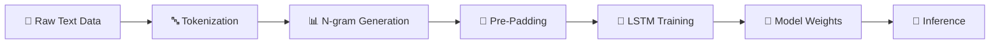

<div align="center">

# 🔮 Turkish Next Word Prediction Engine

### LSTM-Powered Language Model for Turkish Daily Conversations

[](https://python.org)
[](https://tensorflow.org)
[](https://keras.io)
[](LICENSE)

*Türkçe günlük yaşam cümleleri üzerine eğitilmiş, derin öğrenme tabanlı kelime tahmin motoru*

</div>

---

## 📌 Project Motivation

Language modeling, özellikle **Next Word Prediction** görevi, modern NLP sistemlerinin temel yapı taşlarından biridir. Bu proje:

- **Sentetik veri üretimi** yoluyla Türkçe dil kalıplarının modellenmesini
- **Sequential learning** ile bağlamsal kelime ilişkilerinin öğrenilmesini
- **Recurrent Neural Networks** kullanarak uzun dönemli bağımlılıkların yakalanmasını

hedeflemektedir. Türkçe gibi sondan eklemeli (agglutinative) dillerde kelime tahmini, zengin morfolojik yapı nedeniyle özellikle zorlu bir görevdir.

---

## 🏗️ Architecture Overview

```
┌─────────────────────────────────────────────────────────────────┐
│                    📊 DATA PIPELINE                             │
├─────────────────────────────────────────────────────────────────┤
│  Raw Text → Tokenization → N-gram Sequences → Pre-Padding      │
└─────────────────────────────────────────────────────────────────┘
                              ↓
┌─────────────────────────────────────────────────────────────────┐
│                    🧠 MODEL ARCHITECTURE                        │
├─────────────────────────────────────────────────────────────────┤
│  Input → Embedding(50D) → LSTM(100 units) → Dense(Softmax)     │
└─────────────────────────────────────────────────────────────────┘
                              ↓
┌─────────────────────────────────────────────────────────────────┐
│                    🎯 OUTPUT                                    │
├─────────────────────────────────────────────────────────────────┤
│  Probability Distribution → argmax → Predicted Word            │
└─────────────────────────────────────────────────────────────────┘
```

### Technical Deep Dive

| Component | Specification | Purpose |
|-----------|---------------|---------|
| **Embedding Layer** | 50 dimensions | Dense word representations capturing semantic relationships |
| **LSTM Layer** | 100 hidden units | Learning long-term dependencies via gated memory cells |
| **Dense Layer** | Softmax activation | Multi-class probability distribution over vocabulary |
| **Optimizer** | Adam | Adaptive learning rate optimization |
| **Loss Function** | Categorical Crossentropy | Multi-class classification objective |

### N-gram Sequence Generation

```
Input:  "Bugün hava çok güzel"
        ↓ Tokenization
Tokens: [12, 45, 8, 23]
        ↓ N-gram Generation
Sequences:
  [12, 45]           → Target: 45
  [12, 45, 8]        → Target: 8
  [12, 45, 8, 23]    → Target: 23
        ↓ Pre-Padding
  [0, 0, 12, 45]     → 45
  [0, 12, 45, 8]     → 8
  [12, 45, 8, 23]    → 23
```

---

## ⚡ Key Features

| Feature | Description |
|---------|-------------|
| 🧠 **LSTM Power** | Forget/Input/Output gate mekanizması ile sequential data'da üstün performans |
| 🇹🇷 **Native Turkish Support** | Günlük konuşma kalıplarına uygun özel veri seti |
| ⚡ **Scalable Architecture** | Kolayca GRU, Bi-LSTM veya Transformer'a genişletilebilir |
| 🎯 **Pre-padding Strategy** | Değişken uzunluklu sequence'lar için tutarlı input shape |
| 📊 **Softmax Inference** | Vocabulary üzerinde olasılık dağılımı ile kelime tahmini |

---

## 🚀 Installation & Usage

### Prerequisites

```bash
Python >= 3.8
TensorFlow >= 2.x
NumPy
```

### Quick Start

```bash
# Clone the repository
git clone https://github.com/MustafaKocamann/NLP-Projects.git
cd NLP-Projects/text-generation

# Install dependencies
pip install tensorflow numpy

# Train the model and generate text
python train.py
```

### Example Output

```python
# Input seed text
generate_text("Bugün", 3)

# Possible output
>>> "Bugün hava çok güzel"
```

---

## 📈 Training Pipeline



### Training Configuration

| Parameter | Value |
|-----------|-------|
| Epochs | 100 |
| Embedding Dimension | 50 |
| LSTM Units | 100 |
| Optimizer | Adam |
| Loss | Categorical Crossentropy |

---

## 🔮 Future Roadmap

- [ ] 🔄 **GRU Implementation** — Daha hızlı eğitim için Gated Recurrent Unit desteği
- [ ] 🤖 **Transformer Architecture** — Self-attention mekanizması ile modern dil modelleme
- [ ] 📚 **Large-scale Turkish Corpus** — Wikipedia, haber siteleri ve sosyal medya verileri
- [ ] 🌐 **Web API** — FastAPI ile REST endpoint oluşturma
- [ ] 📱 **Mobile Deployment** — TensorFlow Lite ile mobil uygulama entegrasyonu
- [ ] 🎨 **Interactive Demo** — Streamlit veya Gradio ile canlı demo arayüzü

---

## 📂 Project Structure

```
text-generation/
├── train.py          # Main training script with model definition
├── README.md         # Project documentation
└── requirements.txt  # Python dependencies (optional)
```

---

## 🤝 Contributing

Contributions are welcome! Feel free to:

1. Fork the repository
2. Create a feature branch (`git checkout -b feature/amazing-feature`)
3. Commit your changes (`git commit -m 'Add amazing feature'`)
4. Push to the branch (`git push origin feature/amazing-feature`)
5. Open a Pull Request

---

## 📄 License

This project is licensed under the MIT License - see the [LICENSE](LICENSE) file for details.

---

<div align="center">

**Built with ❤️ for the Turkish NLP Community**

[](https://github.com/MustafaKocamann)

</div>
